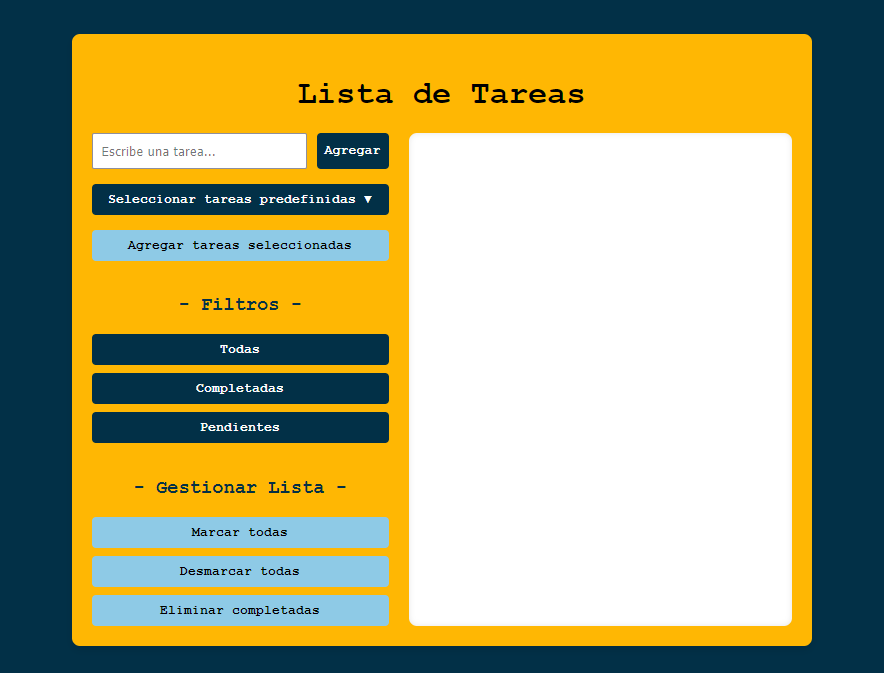

**(Ver. Esp)**

---

**Descripción del Ejercicio**



---

Crea una aplicación básica de Lista de Tareas en JavaScript que permita al usuario:

```
    - Agregar tareas a una lista.
    - Marcar tareas como completadas.
    - Filtrar tareas completadas o pendientes.
    - Eliminar tareas.

```

Se trabajará con conceptos como variables, funciones, condicionales, ciclos, manipulación del DOM, estructuras de datos (arrays y métodos como map, filter, forEach), clases, 
y modularidad.

---

**(Ver. Eng)**

---

**Exercise Description**


---

Create a basic To-Do List application in JavaScript that allows the user to:

```
    - Add tasks to a list.
    - Mark tasks as completed.
    - Filter completed or pending tasks.
    - Delete tasks.

```

You will work with concepts such as variables, functions, conditionals, loops, DOM manipulation, data structures (arrays and methods like map, filter, forEach), classes,
and modularity.

